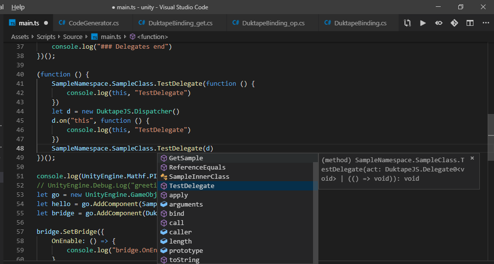
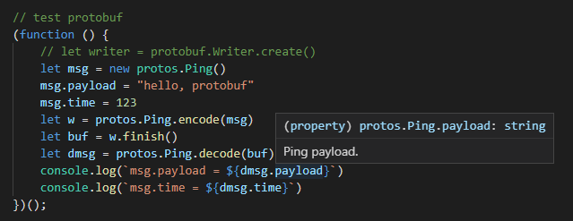
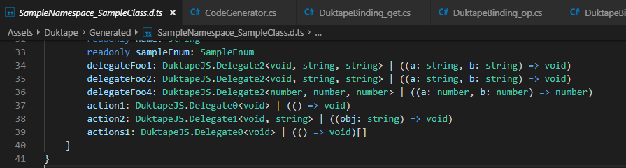
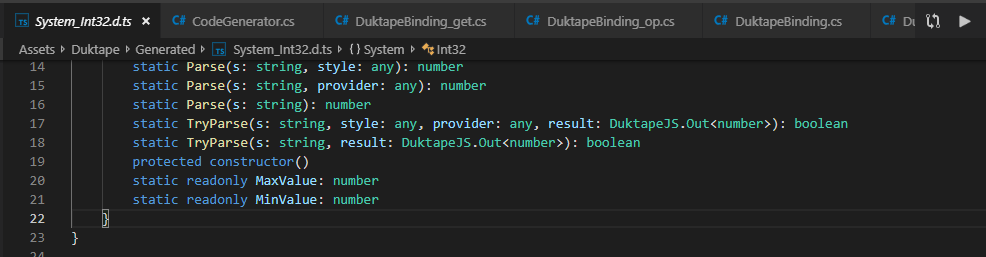
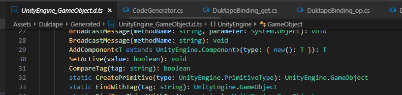
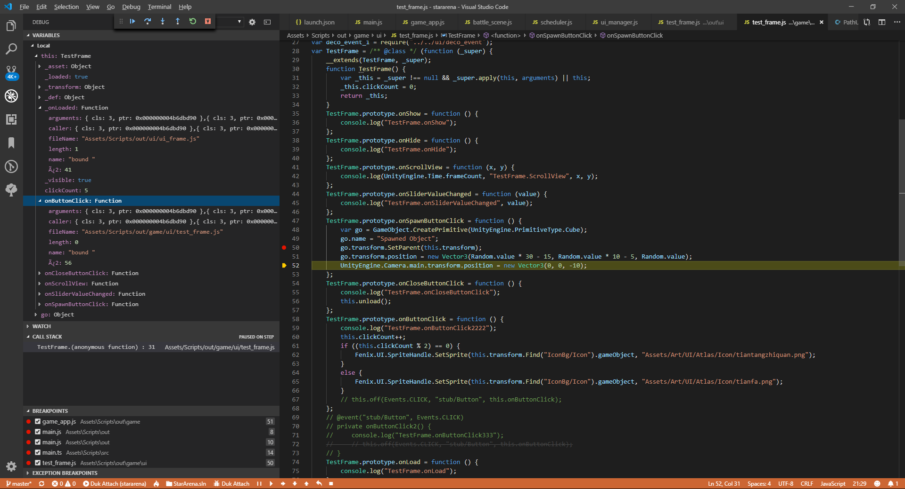

[中文说明](README_CN.md)

# Brief
Integerate duktape (an embedded javascript engine) into unity, you can load and run javascript at runtime. <br/>
Typescript is a preferred choice, it provides type checks.



# Features 
* nodejs-like module or browser-like singular js depends on you
* generate C# to js type binding code, and coresponding d.ts type definition files
* setTimeout/setInterval/clearTimeout/clearInterval compatible
* c# delegates
* optimized unity common valuetypes (Vector2/3,Quaternion,Color...)
* fixed-point math support ([libfixmath](https://github.com/PetteriAimonen/libfixmath))
* websocket ([libwebsockets](https://github.com/warmcat/libwebsockets))
* iOS (64bit, bitcode)
* Android (v7a, v8a, x86)
* remote debugger (vscode)
* promise (bluebird.js)
* tcp (not implemented)
* udp with kcp (not implemented)

You can use lots of pure js libraries in your project, such as protobufjs.


# Type definition files
The generated d.ts files will improve *auto-complete*. It will give the information of exposed types from *C#* and *C*.

- delegate type information

- generic constraints for out/ref parameter

- friendly interface for AddComponent/GetComponent


# Environments
If you use typescript, install typescript at first
```shell
npm install -g typescript
```

If you need to compile duktape source code, python/pip/pyyaml is prerequisites.
```shell
pip install pyyaml

# duktape-2.3.0/src-input: duktape source code
# duktape-2.3.0/src-custom: combined duktape source code
./configure_duktape.bat 
./make_duktape_<platform>
```

'./scratch' is a playground for duktape testing in a simple command line app.
```shell
./configure_duktape_scratch.bat
./make_duktape_scratch.bat
```

# Sample code

```ts

// if your tsconfig.json defined {"module": "commonjs"}, you can 'import' modules like node-js. 

// import module
import { B } from "base/b"
// import module with relative path (. or ..)
import { C } from "./base/c"

class MyPlayer {
    Start() {
        console.log("MyPlayer.Start")
        this.Jump()
    }

    // Update() {
    // }

    Jump() {
        console.log("MyPlayer.Jump")
    }
}

export class A {
    private go: GameObject
    constructor () {
        this.go = new GameObject("test go")
        this.go.transform.localPosition = new Vector3(1, 2, 3) 
        // use Bridge to receive Enable/Disable/Update 
        // don't use the approach a lot, it's better to dispatch futher logic in a single Bridge
        this.go.AddComponent(DuktapeJS.Bridge).SetBridge(new MyPlayer()) 

        let f = new Custom()
        // you can assign function to c# delegate
        f.onopen = function () {
            // ...
        }
        // if you want to register multiple listener, use DuktapeJS.Dispather 
        // you can also use typed Dispatcher generated in _DuktapeDelegates.d.ts, it provides type checks
        f.onload = new DuktapeJS.Dispatcher1<void, string>() 
        f.onload.on(this, this.onload)  // add listener
        f.onload.off(this, this.onload) // remove listener
        f.onload.off(this)              // clear all listeners of this
        f.onload.clear()                // clear all

        // 'out' parameter in c#
        let v = {}
        if (System.Int32.TryParse("123", v)) {
            console.log(v.target)
        }
    }

    private onload(ev: string) {
        let timer1 = setInterval(() => {
            console.log("interval")
        }, 1000)

        setTimeout((a, b) => {
            console.log("timeout", a, b)
            clearInterval(timer1)
        }, 5000, "Arg1", 123)
    }

    square() {
        console.log("A.square")
    }
}

// websocket
let ws = DuktapeJS.WebSocket()
ws.on("open", () => {
    console.log("connected")
    setInterval(() => {
        ws.send("hello, world") // string or buffer 
    }, 1000)
})
ws.on("data", data => {
    console.log("ws receive data", data) // string or buffer (depends on websocket message type you use)
})
ws.on("close", () => {
    console.log("connection lost")
})
ws.connect("ws://127.0.0.1:8080/echo")
setInterval(() => {
    ws.poll()
}, 50)

```

# Dev status 
It's not stable enough, do not use it in production environment.  <br/>
Vector2/Matrix3x3/Matrix4x4/Quaternion valuetypes optimization is partially written in c, and not fully tested. <br/>

# Usage

Execute menu item [Duktape -> Generate Bindings] to generate binding code.
Typescript source files will be compiled into js after your modification and switch back to Unity Editor.


## How to customize exported types

* duktape.json
modify the basic configuration at ./duktape.json (details in Assets/Duktape/Editor/Prefs.cs)
```json
{
    "outDir": "Assets/Generated",
    "typescriptDir": "Assets/Generated",
    "extraExt": "",
    // rootpath of ts/js project
    "workspace": "",
    "logPath": "Temp/duktape.log",
    // auto, cr, lf, crlf
    "newLineStyle": "auto",
    "implicitAssemblies": [
        "UnityEngine",
        "UnityEngine.CoreModule", 
        "UnityEngine.UI", 
        "UnityEngine.UIModule"
    ], 
    "explicitAssemblies": [
        "Assembly-CSharp"
    ],
    // types in blacklist will not be exported
    "typePrefixBlacklist": [
        "JetBrains.",
        "Unity.Collections.",
        "Unity.Jobs.",
        "Unity.Profiling.",
        "UnityEditor.",
        "UnityEditorInternal.",
        "UnityEngineInternal.",
        "UnityEditor.Experimental.",
        "UnityEngine.Experimental.",
        "Unity.IO.LowLevel.",
        "Unity.Burst.",
        // more types ...
        "UnityEngine.Assertions."
    ], 
    "ns": "DuktapeJS",
    "tab": "    "
}
```
* implements Duktape.IBindingProcess interface or extends AbstractBindingProcess class
```c#
public class MyCustomBinding : AbstractBindingProcess
{
    public override void OnPreCollectTypes(BindingManager bindingManager)
    {
        /*
        bindingManager.AddExportedType(typeof(MyCustomClass));
        bindingManager.TransformType(typeof(MyCustomClass))
            .SetMethodBlocked("AMethodName")
            .SetMethodBlocked("AMethodNameWithParameters", typeof(string), typeof(int))
        */
    }

    public override void OnCleanup(BindingManager bindingManager)
    {
        Debug.Log($"finish @ {DateTime.Now}");
    }
}
```

## Sample scene
Assets/Scenes/main.unity (Sample.cs) demonstrate the basic usage.<br/>

# Debugger

Support js/ts remote debug.

## the prebuilt library for android/ios is compiled without debugger support.



```yml
Name: Duktape Debugger
Id: haroldbrenes.duk-debug
Description: Debug Adapter for Duktape runtimes.
Version: 0.5.6
Publisher: HaroldBrenes
VS Marketplace Link: https://marketplace.visualstudio.com/items?itemName=HaroldBrenes.duk-debug
```
If you are debugging ts sources, this extension has some path-resolve issues break the debug process, you can try [the modified version](https://github.com/ialex32x/vscode-duktape-debug/releases/download/v0.5.6ts/duk-debug-0.5.6.vsix).

# Referenced libraries

* [duktape](https://github.com/svaarala/duktape)
* [slua](https://github.com/pangweiwei/slua)
* [xLua](https://github.com/Tencent/xLua)
* [typescript-for-unity](https://github.com/SpiralP/typescript-for-unity)
* [godot](https://github.com/godotengine/godot)
* [libwebsockets](https://github.com/warmcat/libwebsockets)
* [mbedtls](https://github.com/ARMmbed/mbedtls)
* [libfixmath](https://github.com/PetteriAimonen/libfixmath)
* [bluebird.js](https://github.com/petkaantonov/bluebird)

# Misc.

* [vscode-duktape-debug](https://github.com/harold-b/vscode-duktape-debug)
* [duktape-doc-debugger](https://github.com/svaarala/duktape/blob/master/doc/debugger.rst)

